# T09 · 5 porqués: ejemplos en prosa

Estos ejemplos se escribieron antes del código (sección 10, propuesta 3) y son el oráculo de la técnica. T09 no usa el
modelo. En el Diario de decisiones aparece en el paso 0, junto a la definición del problema (sección 6).

| Ejemplo | Ámbito | Qué ejercita |
|---|---|---|
| 1 · El pan quemado | trabajo | la tarjeta de la sección 7b: una cadena con causa raíz marcada, evidencia que falta y su DOT |
| 2 · Los robos de noche | comunidad | una rama: una cadena llega al último nivel y otra queda sin terminar |
| 3 · Tarde al colegio | personal | una cadena corta que no llega a la causa raíz |

## Reglas de cálculo

El documento fija "número de niveles (3 a 7), exigir evidencia por nivel, permitir ramas" y "cadena causal + causa raíz".
Lo que no decía está marcado como decisión.

1. **Entrada**: el problema y de 1 a 12 porqués. Cada porqué tiene código (P1, P2…, por su fila), texto (la respuesta a
   "¿por qué?"), evidencia (el dato que lo respalda, opcional), "responde a" y la marca "aquí paro: es la causa raíz".
2. **Responde a** (decisión): vacío quiere decir la fila anterior (la primera responde al problema). Con ramas
   activas se puede escribir el código de una fila anterior o la palabra `problema`. Con ramas apagadas tiene que
   quedar vacío.
3. **Niveles** (decisión): el problema es el nivel 0; cada porqué está un nivel más abajo que aquello a lo que
   responde. La validación rechaza un porqué que pase el número de niveles de la configuración ("P4 queda en el nivel 4
   y la configuración permite 3: sube los niveles o quítalo") y un "responde a" que no exista o que esté después.
4. **Causa raíz** (decisión): un porqué sin hijos es **causa raíz** si está en el último nivel de la configuración o
   si la persona marcó "aquí paro". Un porqué sin hijos en un nivel anterior y sin esa marca queda **sin terminar**:
   falta preguntar por qué.
5. **Evidencia por nivel**: se cuentan los porqués con evidencia escrita. Si la configuración la exige, un aviso
   nombra los que no la tienen: "Falta evidencia en P3: la configuración la exige." No bloquea.
6. **Pendientes**: uno de verificación por cada causa raíz ("Verificar la causa raíz: {texto}") y uno de revisión por
   cada porqué sin terminar ("Seguir preguntando por qué: {texto}").
7. **Resumen**: "{N} porqué(s) · {K} causa(s) raíz · evidencia en {E} de {N}."; si hay porqués sin terminar, se agrega
   " · {U} sin terminar" antes de la evidencia.
8. **Afirmaciones producidas**: el problema, rol `premisa`, tipo `hecho`; cada porqué, rol `hipotesis`, tipo `causal`;
   cada causa raíz, rol `conclusion`, tipo `causal`. Origen `usuario`.
9. **Cadena (patrón V06)**: Graphviz dibuja de izquierda a derecha, con el convenio de la sección 7: cada nodo lleva
   como id el identificador de su afirmación y una clase (`problema`, `porque`, `porque raiz` o `porque sin-terminar`);
   la etiqueta de una causa raíz suma "causa raíz" en una segunda línea y la de un porqué sin terminar, "sin terminar".
   Las aristas van de lo que se pregunta a su respuesta, con clase `por-que` y la etiqueta "¿por qué?". Sin colores en el
   DOT. Debajo del dibujo va la misma cadena como lista con sangría y la evidencia de cada porqué.

## Ejemplo 1 · Trabajo: el pan quemado

**Configuración**: 5 niveles · exigir evidencia · sin ramas.

**Datos ficticios.** El lunes se quemó la primera tanda y la dueña pregunta por qué hasta llegar al fondo.

- Problema: "Se quemó la tanda de pan de las 6."

| Porqué | Texto | Evidencia | Responde a | Aquí paro |
|---|---|---|---|---|
| P1 | El horno marcó 30 grados de más. | La pantalla del horno a las 6:10. | — | no |
| P2 | El termostato está descalibrado. | El técnico lo midió con otro termómetro. | — | no |
| P3 | Nadie lo revisa desde hace un año. | — | — | no |
| P4 | No existe un calendario de mantenimiento. | El cuaderno de mantenimiento está vacío. | — | sí |

**Cálculo a mano.**

1. Niveles: P1 en el 1, P2 en el 2, P3 en el 3, P4 en el 4. Ninguno pasa de 5.
2. P4 no tiene hijos y está marcado "aquí paro": causa raíz. Los demás tienen hijos.
3. Evidencia: P1, P2 y P4 la tienen; P3 no. 3 de 4.

**Resultado.**

- Cadena: Se quemó la tanda de pan de las 6 → P1 → P2 → P3 → P4 (causa raíz).
- Avisos: "Falta evidencia en P3: la configuración la exige."
- Pendientes: "Verificar la causa raíz: No existe un calendario de mantenimiento."
- Resumen: "4 porqués · 1 causa raíz · evidencia en 3 de 4."

**DOT esperado** (los identificadores reales son uuidv7 de cada afirmación; las etiquetas se parten en líneas de unas 28
letras):

```dot
digraph porques {
  graph [rankdir=LR, nodesep=0.25, ranksep=0.45];
  node [shape=box, style=rounded, fontname="Helvetica", fontsize=11, margin="0.15,0.08"];
  edge [fontname="Helvetica", fontsize=9];
  "{id problema}" [id="{id problema}", class="problema", label="Se quemó la tanda de pan de\nlas 6."];
  "{id P1}" [id="{id P1}", class="porque", label="P1 · El horno marcó 30\ngrados de más."];
  "{id P2}" [id="{id P2}", class="porque", label="P2 · El termostato está\ndescalibrado."];
  "{id P3}" [id="{id P3}", class="porque", label="P3 · Nadie lo revisa desde\nhace un año."];
  "{id P4}" [id="{id P4}", class="porque raiz", label="P4 · No existe un calendario\nde mantenimiento.\ncausa raíz"];
  "{id problema}" -> "{id P1}" [class="por-que", label="¿por qué?"];
  "{id P1}" -> "{id P2}" [class="por-que", label="¿por qué?"];
  "{id P2}" -> "{id P3}" [class="por-que", label="¿por qué?"];
  "{id P3}" -> "{id P4}" [class="por-que", label="¿por qué?"];
}
```

## Ejemplo 2 · Comunidad: los robos de noche

**Configuración**: 3 niveles · sin exigir evidencia · con ramas.

**Datos ficticios.** La junta pregunta por qué por dos caminos.

- Problema: "Hay robos de noche en la cuadra."

| Porqué | Texto | Evidencia | Responde a | Aquí paro |
|---|---|---|---|---|
| P1 | La cuadra está oscura. | — | — | no |
| P2 | Dos postes están apagados. | Lo vimos el martes. | — | no |
| P3 | Nadie avisó a la alcaldía. | — | — | no |
| P4 | Nadie camina de noche. | — | problema | no |
| P5 | Los negocios cierran a las 7. | — | — | no |

**Cálculo a mano.**

1. Niveles: P1 en el 1 (responde al problema), P2 en el 2, P3 en el 3; P4 responde al problema y queda en el 1; P5
   responde a P4 (la fila anterior) y queda en el 2. Ninguno pasa de 3.
2. Sin hijos: P3 y P5. P3 está en el nivel 3, el último: causa raíz. P5 está en el nivel 2 y no tiene la marca: sin
   terminar.
3. Evidencia: solo P2. 1 de 5.

**Resultado.**

- Cadena con una rama: problema → P1 → P2 → P3 (causa raíz); problema → P4 → P5 (sin terminar).
- Avisos: ninguno (la evidencia no se exige).
- Pendientes: "Verificar la causa raíz: Nadie avisó a la alcaldía." y "Seguir preguntando por qué: Los negocios cierran a
  las 7."
- Resumen: "5 porqués · 1 causa raíz · 1 sin terminar · evidencia en 1 de 5."

## Ejemplo 3 · Personal: tarde al colegio

**Configuración**: 3 niveles · exigir evidencia · sin ramas.

**Datos ficticios.** La mamá se pregunta por qué los niños llegaron tarde.

- Problema: "Llegamos tarde al colegio tres veces esta semana."

| Porqué | Texto | Evidencia | Responde a | Aquí paro |
|---|---|---|---|---|
| P1 | Salimos de la casa a las 7:20. | El reloj de la cocina. | — | no |
| P2 | El desayuno se demora. | — | — | no |

**Cálculo a mano.**

1. Niveles: P1 en el 1, P2 en el 2.
2. P2 no tiene hijos, está en el nivel 2 de 3 y no tiene la marca: sin terminar. No hay causa raíz.
3. Evidencia: solo P1. 1 de 2.

**Resultado.**

- Avisos: "Falta evidencia en P2: la configuración la exige."
- Pendientes: "Seguir preguntando por qué: El desayuno se demora."
- Resumen: "2 porqués · 0 causas raíz · 1 sin terminar · evidencia en 1 de 2."
