# T26 · Estimación de Fermi: ejemplos en prosa

Estos ejemplos se escribieron antes del código (sección 10, propuesta 3) y son el oráculo de la técnica. Los valores se
calcularon a mano; las pruebas los copian como literales. T26 no usa el modelo.

| Ejemplo | Ámbito | Qué ejercita |
|---|---|---|
| 1 · Los panes del centro | trabajo | la tarjeta de la sección 7b: cuatro factores, un porcentaje y una referencia dentro del rango |
| 2 · El agua de la casa | personal | menos factores que los que pide la configuración |
| 3 · La feria del barrio | comunidad | un rango de más de 100 veces y el factor más ancho |

## Reglas de cálculo

El documento fija "pasos de descomposición, rango mínimo y máximo, unidades" y "estimación con rango". Lo que no decía
está marcado como decisión.

1. **Entrada**: la pregunta, la unidad del resultado y de 1 a 8 factores. Cada factor lleva texto, mínimo y máximo
   (enteros, 0 o más, máximo mayor o igual que el mínimo), su unidad y si es un porcentaje (entonces cuenta el número
   dividido por 100). Opcional: una referencia conocida (un número y de dónde sale) para comparar.
2. **Rango** (decisión): el mínimo es el producto de los mínimos y el máximo, el de los máximos, sin redondeos
   intermedios; cada extremo se muestra redondeado a entero, la mitad hacia arriba.
3. **Valor central** (decisión): la media geométrica del rango, la raíz cuadrada de mínimo × máximo, redondeada a dos
   cifras significativas y nunca a menos de un entero. Es el número que queda "en el medio" cuando los factores se
   multiplican.
4. **Ancho**: máximo / mínimo, en veces. Si pasa de 100: "El rango va de A a B: más de 100 veces. Parte el factor más
   ancho en dos."
5. **Pasos mínimos** (decisión: aviso, no error): si hay menos factores que los que pide la configuración, "Con N
   factores: la configuración pide al menos M. Descompón el factor más incierto."
6. **Unidades**: si la configuración las exige, cada factor debe tener su unidad (error de validación si falta).
7. **Referencia**: "R está dentro del rango." o "R está fuera del rango: revisa los factores o la referencia."
8. **Pendiente** (decisión): uno de verificación por el factor más ancho (máximo / mínimo; si dos empatan, el primero),
   "Buscar un dato para el factor más incierto: {texto}", salvo que todos los factores sean exactos.
9. **Resumen**: "Entre A y B {unidad}, central C · N factores."
10. **Afirmaciones producidas**: la estimación ("{pregunta}: entre A y B {unidad}"), rol `hipotesis`, tipo
    `dato_estadistico`; cada factor, rol `supuesto`, tipo `dato_estadistico`. Origen `usuario`.
11. **Cadena (patrón V06)**: Graphviz dibuja los factores en fila, de izquierda a derecha, hasta el resultado. Cada nodo
    lleva como id el identificador de su afirmación y una clase: `factor` (o `factor ancho` para el más incierto) y
    `resultado`. Los colores los pone `app.css`.

## Ejemplo 1 · Trabajo: los panes del centro

**Configuración**: pasos mínimos 3 · exigir unidades.

**Datos ficticios.** La dueña quiere saber si la sucursal del centro vendería lo suficiente.

- Pregunta: "¿Cuántos panes vendería la sucursal del centro por día?" · Unidad: "panes por día".
- F1 · Peatones por hora frente al local: 300 a 600, "peatones por hora".
- F2 · Horas de apertura: 10 a 10, "horas".
- F3 · Fracción de peatones que entra: 2 a 4, porcentaje.
- F4 · Panes por compra: 2 a 3, "panes".
- Referencia: 260, "lo que vende hoy la sucursal original".

**Cálculo a mano.**

1. Mínimo: 300 × 10 × 0,02 × 2 = 120.
2. Máximo: 600 × 10 × 0,04 × 3 = 720.
3. Central: √(120 × 720) = √86400 = 293,94 → dos cifras significativas: **290**.
4. Ancho: 720 / 120 = 6 veces.
5. Factor más ancho: F1 600 / 300 = 2; F2 1; F3 4 / 2 = 2; F4 1,5. Empatan F1 y F3: gana F1, que va primero.
6. 260 está entre 120 y 720.

**Resultado.**

- Estimación: entre 120 y 720 panes por día, central 290.
- Referencia: "260 está dentro del rango."
- Avisos: ninguno.
- Pendientes: "Buscar un dato para el factor más incierto: Peatones por hora frente al local"
- Resumen: "Entre 120 y 720 panes por día, central 290 · 4 factores."

La tarjeta de la sección 7b dice "mediana 300": con dos cifras significativas, la media geométrica da 290. La regla 3 es
la decisión que manda.

**DOT esperado** (los identificadores reales son uuidv7 de cada afirmación):

```dot
digraph fermi {
  graph [rankdir=LR, nodesep=0.3, ranksep=0.4];
  node [shape=box, style=rounded, fontname="Helvetica", fontsize=11];
  "{id F1}" [id="{id F1}", class="factor ancho", label="F1 · Peatones por hora frente al local\n300 a 600 peatones por hora"];
  "{id F2}" [id="{id F2}", class="factor", label="F2 · Horas de apertura\n10 horas"];
  "{id F3}" [id="{id F3}", class="factor", label="F3 · Fracción de peatones que entra\n2% a 4%"];
  "{id F4}" [id="{id F4}", class="factor", label="F4 · Panes por compra\n2 a 3 panes"];
  "{id resultado}" [id="{id resultado}", class="resultado", label="Entre 120 y 720 panes por día\ncentral 290"];
  "{id F1}" -> "{id F2}" [class="multiplica", label="×"];
  "{id F2}" -> "{id F3}" [class="multiplica", label="×"];
  "{id F3}" -> "{id F4}" [class="multiplica", label="×"];
  "{id F4}" -> "{id resultado}" [class="da", label="="];
}
```

## Ejemplo 2 · Personal: el agua de la casa

**Configuración**: pasos mínimos 5 · exigir unidades.

**Datos ficticios.** La familia quiere saber cuánta agua se va en duchas antes de cambiar la regadera.

- Pregunta: "¿Cuántos litros de agua se van en duchas por semana?" · Unidad: "litros por semana".
- F1 · Personas en la casa: 4 a 4, "personas".
- F2 · Minutos de ducha por persona al día: 5 a 10, "minutos".
- F3 · Litros por minuto de la regadera: 8 a 12, "litros por minuto".
- F4 · Días de la semana: 7 a 7, "días".
- Sin referencia.

**Cálculo a mano.**

1. Mínimo: 4 × 5 × 8 × 7 = 1120. Máximo: 4 × 10 × 12 × 7 = 3360.
2. Central: √(1120 × 3360) = √3763200 = 1939,9 → **1900**.
3. Ancho: 3 veces. Factor más ancho: F2 (10 / 5 = 2) contra F3 (1,5).
4. Hay 4 factores y la configuración pide 5: aviso.

**Resultado.**

- Estimación: entre 1120 y 3360 litros por semana, central 1900.
- Avisos: "Con 4 factores: la configuración pide al menos 5. Descompón el factor más incierto."
- Pendientes: "Buscar un dato para el factor más incierto: Minutos de ducha por persona al día"
- Resumen: "Entre 1120 y 3360 litros por semana, central 1900 · 4 factores."

## Ejemplo 3 · Comunidad: la feria del barrio

**Configuración**: pasos mínimos 3 · exigir unidades.

**Datos ficticios.** La junta quiere saber cuántas sillas alquilar para la feria.

- Pregunta: "¿Cuántas personas vendrían a la feria del barrio?" · Unidad: "personas".
- F1 · Casas en el barrio: 400 a 500, "casas".
- F2 · Personas por casa: 2 a 4, "personas".
- F3 · Fracción que se entera: 10 a 80, porcentaje.
- F4 · Fracción de los que se enteran que viene: 5 a 50, porcentaje.
- Referencia: 150, "a la feria del año pasado vinieron".

**Cálculo a mano.**

1. Mínimo: 400 × 2 × 0,10 × 0,05 = 4. Máximo: 500 × 4 × 0,80 × 0,50 = 800.
2. Central: √(4 × 800) = √3200 = 56,57 → **57**.
3. Ancho: 800 / 4 = 200 veces: más de 100, aviso.
4. Factor más ancho: F4 (50 / 5 = 10) contra F3 (8), F2 (2) y F1 (1,25).
5. 150 está entre 4 y 800.

**Resultado.**

- Estimación: entre 4 y 800 personas, central 57.
- Referencia: "150 está dentro del rango."
- Avisos: "El rango va de 4 a 800: más de 100 veces. Parte el factor más ancho en dos."
- Pendientes: "Buscar un dato para el factor más incierto: Fracción de los que se enteran que viene"
- Resumen: "Entre 4 y 800 personas, central 57 · 4 factores."
