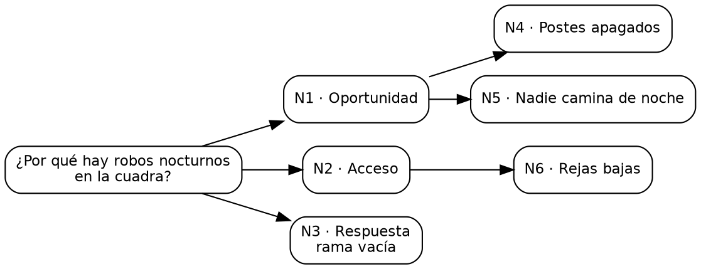

# T42 · Árbol de hipótesis MECE: ejemplos en prosa

Estos ejemplos se escribieron antes del código (sección 10, propuesta 3) y son el oráculo de la técnica. T42 no usa el
modelo. MECE quiere decir "mutuamente excluyentes, colectivamente exhaustivas": las ramas no se pisan y entre todas
cubren el problema.

| Ejemplo | Ámbito | Qué ejercita |
|---|---|---|
| 1 · Los robos nocturnos | comunidad | la tarjeta de la sección 7b: sin solapes, una rama vacía |
| 2 · Las ventas del sábado | trabajo | la verificación encuentra un solape entre dos hojas hermanas |
| 3 · La plata que no alcanza | personal | tres niveles; "gastos fijos" y "gastos variables" no se solapan |

## Reglas de cálculo

El documento fija "profundidad del árbol, verificación MECE automática, hojas mínimas por rama" y "diagrama SVG, lista de
hojas, solapes y huecos señalados". Lo que no decía está marcado como decisión.

1. **Entrada**: la raíz (el problema o la pregunta) y de 1 a 20 nodos. Cada nodo tiene código (N1, N2…, por su fila),
   texto y padre: el código de otro nodo escrito antes, o vacío si cuelga de la raíz.
2. **Validación** (decisión): el padre existe y está antes (así no hay ciclos ni nodos huérfanos) y ningún nodo pasa la
   profundidad máxima de la configuración (la raíz es 0; los hijos de la raíz, 1).
3. **Ramas y hojas** (decisión): las **ramas** son los hijos directos de la raíz; las **hojas**, los nodos sin hijos de
   profundidad 2 o más. Una rama sin hijos no es hoja: es una **rama vacía**.
4. **Huecos** (lo colectivamente exhaustivo que se puede revisar sin saber del tema): una rama con 0 hojas es "rama
   vacía"; una con menos hojas que el mínimo de la configuración "le falta(n) N hoja(s)". Las hojas de una rama se cuentan
   en todos sus niveles.
5. **Solapes** (lo mutuamente excluyente, decisión): dos nodos **hermanos** se solapan si comparten **más de la mitad**
   de las palabras del más corto. Las palabras se comparan en minúscula y sin tildes, y no cuentan estas: el, la, los,
   las, un, una, unos, unas, de, del, al, a, en, y, o, que, por, para, con, se, su, sus, lo, es, no. Es una alarma, no un
   juicio: dos frases distintas pueden decir lo mismo y la regla no lo verá.
6. **Pendientes**: uno de revisión por cada rama vacía ("Completar la rama vacía: {rama}"), por cada rama con hojas de
   menos ("Agregar hojas a: {rama}") y por cada solape ("Separar «A» y «B»: se solapan").
7. **Resumen**: "N rama(s), M hoja(s) · {sin solapes | K solape(s)} · {sin huecos | 1 rama vacía | …}". Si hay ramas
   vacías y ramas con hojas de menos, las dos partes van separadas por coma.
8. **Afirmaciones producidas**: la raíz, rol `postura`, tipo `hecho`; cada nodo, rol `hipotesis`, tipo `causal`. Origen
   `usuario`.
9. **Árbol (patrón V06)**: Graphviz dibuja de izquierda a derecha. Cada nodo lleva como id el identificador de su
   afirmación y una clase: `raiz`, `rama`, `rama vacia`, `intermedio`, `hoja`; un nodo con solape suma `solape`. Las
   aristas llevan clase `descompone`. Sin colores en el DOT: los pone `app.css`.

## Ejemplo 1 · Comunidad: los robos nocturnos

**Configuración**: profundidad máxima 3 · 1 hoja mínima por rama · verificación MECE.

**Datos ficticios.** La junta descompone el problema antes de elegir qué hacer.

- Raíz: "¿Por qué hay robos nocturnos en la cuadra?"

| Nodo | Texto | Padre |
|---|---|---|
| N1 | Oportunidad | — |
| N2 | Acceso | — |
| N3 | Respuesta | — |
| N4 | Postes apagados | N1 |
| N5 | Nadie camina de noche | N1 |
| N6 | Rejas bajas | N2 |

**Cálculo a mano.**

1. Ramas: N1, N2, N3. Hojas: N4, N5 (de N1) y N6 (de N2). N3 no tiene hijos: rama vacía.
2. Solapes entre hermanos: N1, N2 y N3 son palabras distintas; N4 {postes, apagados} y N5 {nadie, camina, noche} no
   comparten ninguna. Sin solapes.

**Resultado.**

- Hojas: Postes apagados · Nadie camina de noche · Rejas bajas.
- Huecos: "Respuesta: rama vacía."
- Pendientes: "Completar la rama vacía: Respuesta"
- Resumen: "3 ramas, 3 hojas · sin solapes · 1 rama vacía."

**DOT esperado** (los identificadores reales son uuidv7 de cada afirmación):

## Ejemplo 2 · Trabajo: las ventas del sábado

**Configuración**: profundidad máxima 3 · 2 hojas mínimas por rama · verificación MECE.

**Datos ficticios.** La dueña descompone la baja de ventas.

- Raíz: "¿Por qué bajaron las ventas del sábado?"

| Nodo | Texto | Padre |
|---|---|---|
| N1 | Vienen menos clientes | — |
| N2 | Cada cliente compra menos | — |
| N3 | Se fueron a la feria | N1 |
| N4 | Están de vacaciones | N1 |
| N5 | Compran menos pan por el precio | N2 |
| N6 | Compran menos pan dulce por el precio | N2 |

**Cálculo a mano.**

1. Ramas: N1 (hojas N3, N4) y N2 (hojas N5, N6): las dos tienen 2, el mínimo. Sin huecos.
2. Solapes entre hermanos:
   - N1 {vienen, menos, clientes} y N2 {cada, cliente, compra, menos}: comparten "menos"; 1 de 3 no es más de la mitad.
   - N3 {fueron, feria} y N4 {estan, vacaciones}: ninguna.
   - N5 {compran, menos, pan, precio} y N6 {compran, menos, pan, dulce, precio}: comparten 4 de las 4 del más corto:
     **solape**.

**Resultado.**

- Solapes: "Compran menos pan por el precio" y "Compran menos pan dulce por el precio".
- Pendientes: "Separar «Compran menos pan por el precio» y «Compran menos pan dulce por el precio»: se solapan"
- Resumen: "2 ramas, 4 hojas · 1 solape · sin huecos."

## Ejemplo 3 · Personal: la plata que no alcanza

**Configuración**: profundidad máxima 3 · 2 hojas mínimas por rama · verificación MECE.

**Datos ficticios.** La familia busca por dónde se va la plata.

- Raíz: "¿Por qué no nos alcanza la plata?"

| Nodo | Texto | Padre |
|---|---|---|
| N1 | Entra menos | — |
| N2 | Sale más | — |
| N3 | Gastos fijos | N2 |
| N4 | Gastos variables | N2 |
| N5 | Subió el arriendo | N3 |
| N6 | Domicilios | N4 |
| N7 | Mercado | N4 |

**Cálculo a mano.**

1. Ramas: N1 sin hijos (rama vacía) y N2. N3 y N4 son intermedios; las hojas de N2 son N5, N6 y N7: 3, más que el mínimo.
2. Solapes: N1 {entra, menos} y N2 {sale, mas}: ninguna. N3 {gastos, fijos} y N4 {gastos, variables}: comparten 1 de 2,
   que no es más de la mitad. N6 y N7: ninguna.

**Resultado.**

- Hojas: Subió el arriendo · Domicilios · Mercado.
- Huecos: "Entra menos: rama vacía."
- Pendientes: "Completar la rama vacía: Entra menos"
- Resumen: "2 ramas, 3 hojas · sin solapes · 1 rama vacía."
