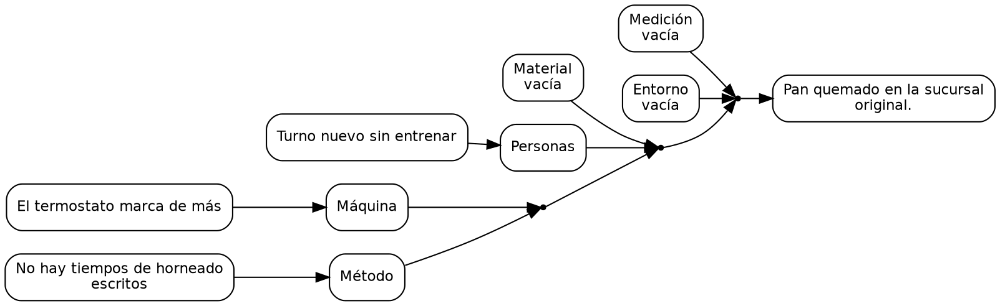

# T43 · Diagrama de Ishikawa: ejemplos en prosa

Estos ejemplos se escribieron antes del código (sección 10, propuesta 3) y son el oráculo de la técnica. T43 no usa el
modelo. Ishikawa y el árbol MECE de T42 · Árbol de hipótesis MECE son dos vistas del mismo conjunto de causas: en el
Diario, "Ver como árbol MECE" convierte cada categoría en una rama y cada causa en una hoja.

| Ejemplo | Ámbito | Qué ejercita |
|---|---|---|
| 1 · El pan quemado | trabajo | la tarjeta de la sección 7b: las 6M, tres categorías vacías |
| 2 · Los robos nocturnos | comunidad | el mockup del paso 0: categorías propias, dos vacías |
| 3 · Tarde al colegio | personal | dos causas mínimas por categoría |

## Reglas de cálculo

El documento fija "categorías (6M o propias), causas mínimas por categoría" y "diagrama SVG y categorías vacías
señaladas". Lo que no decía está marcado como decisión.

1. **Categorías** (decisión): la configuración las escribe separadas por comas, de 2 a 8; por defecto las 6M en llano:
   "Máquina, Método, Material, Personas, Medición, Entorno". Escribir otras es usar categorías propias.
2. **Entrada**: el efecto (el problema) y de 1 a 24 causas, cada una con texto y categoría (una de las de la
   configuración).
3. **Por categoría**, en el orden de la configuración: sus causas en el orden en que se escribieron; **vacía** si no tiene
   ninguna; "le falta(n) N causa(s)" si tiene alguna pero menos que el mínimo.
4. **Pendientes**: ninguno (las categorías vacías se señalan en el resultado).
5. **Resumen**: "N causa(s) en K de M categorías" más " · V categoría(s) vacía(s)" si las hay y " · F con menos de C
   causas" si las hay; punto final.
6. **Afirmaciones producidas**: el efecto, rol `conclusion`, tipo `hecho`; cada causa, rol `hipotesis`, tipo `causal`.
   Origen `usuario`.
7. **Espina de pescado (patrón V07)**: Graphviz dibuja de izquierda a derecha una espina de puntos que termina en el
   efecto. Las categorías se cuelgan de a dos por punto, en su orden; cada causa, de su categoría. Clases: `efecto`,
   `espina` (los puntos), `categoria` o `categoria vacia`, `causa`; aristas `espina`, `categoria` y `causa`. Los nodos de
   causa y efecto llevan como id el identificador de su afirmación; los puntos y las categorías, el id del fragmento más
   "-espina-N" y "-categoria-N". Sin colores en el DOT.

## Ejemplo 1 · Trabajo: el pan quemado

**Configuración**: categorías "Máquina, Método, Material, Personas, Medición, Entorno" · 1 causa mínima.

**Datos ficticios.** En la sucursal original el pan de las 6 sale quemado.

- Efecto: "Pan quemado en la sucursal original."
- "El termostato marca de más" · Máquina.
- "No hay tiempos de horneado escritos" · Método.
- "Turno nuevo sin entrenar" · Personas.

**Resultado.**

- Máquina: El termostato marca de más · Método: No hay tiempos de horneado escritos · Material: vacía · Personas: Turno
  nuevo sin entrenar · Medición: vacía · Entorno: vacía.
- Pendientes: ninguno.
- Resumen: "3 causas en 3 de 6 categorías · 3 categorías vacías."

**DOT esperado** (los identificadores reales son uuidv7 de cada afirmación; {res} es el id del fragmento):

## Ejemplo 2 · Comunidad: los robos nocturnos

**Configuración**: categorías "Personas, Procesos, Herramientas, Conocimiento, Presupuesto, Tiempo" · 1 causa mínima.

**Datos ficticios.** La junta dibuja las causas en el paso 0 del Diario.

- Efecto: "Robos nocturnos en la cuadra."
- "Nadie vigila" · Personas.
- "No hay ronda" · Procesos.
- "No se denuncia" · Conocimiento.
- "No hay fondo común" · Presupuesto.

**Resultado.**

- Vacías: Herramientas y Tiempo.
- Pendientes: ninguno.
- Resumen: "4 causas en 4 de 6 categorías · 2 categorías vacías."

**Vista como árbol MECE** (T42 · Árbol de hipótesis MECE con 1 hoja mínima): ramas Personas, Procesos, Herramientas,
Conocimiento, Presupuesto y Tiempo; hojas las cuatro causas. Sin solapes; Herramientas y Tiempo son ramas vacías: "6
ramas, 4 hojas · sin solapes · 2 ramas vacías."

## Ejemplo 3 · Personal: tarde al colegio

**Configuración**: categorías "Mañana, Transporte, Personas" · 2 causas mínimas.

**Datos ficticios.** La familia llega tarde al colegio casi todos los días.

- Efecto: "Llegamos tarde al colegio casi todos los días."
- "Nadie deja la ropa lista la noche anterior" · Mañana.
- "Desayunamos tarde" · Mañana.
- "El bus pasa lleno" · Transporte.
- "La hija no se quiere levantar" · Personas.

**Resultado.**

- Mañana: 2 causas. Transporte: 1, le falta 1 causa. Personas: 1, le falta 1 causa.
- Pendientes: ninguno.
- Resumen: "4 causas en 3 de 3 categorías · 2 con menos de 2 causas."
